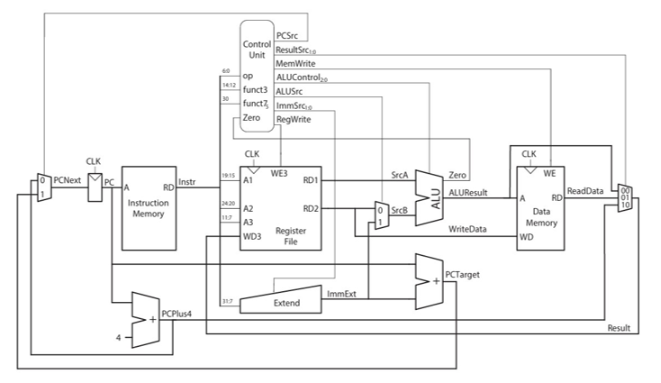
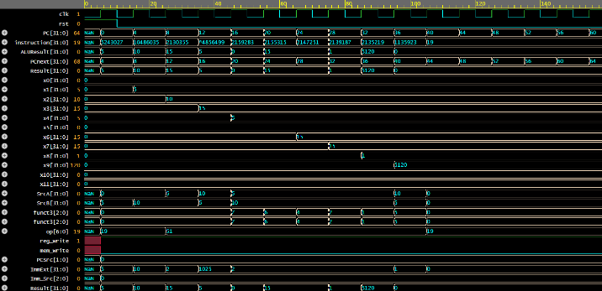

# RISC-V Single Cycle Processor Using Verilog

## Overview

This project presents the design and implementation of a 32-bit Single-Cycle RISC-V Processor based on the RV32I instruction set architecture using Verilog HDL.

The processor executes every instruction within a single clock cycle and integrates essential processor components such as the Program Counter (PC), Instruction Memory, Register File, Control Unit, Arithmetic Logic Unit (ALU), Data Memory, and supporting datapath modules.

---

## Features

* 32-Bit RISC-V Processor
* RV32I Instruction Set Support
* Single-Cycle Instruction Execution
* Register File with 32 Registers
* ALU-Based Arithmetic and Logical Operations
* Load and Store Instructions
* Branch and Jump Instructions
* Immediate Value Generation
* Control Signal Generation
* Verilog Testbench Verification

---

## System Architecture

The processor consists of multiple interconnected hardware blocks that execute instructions in a single clock cycle.




---

## Instruction Execution Flow

Each instruction is completed within one clock cycle.

```text
Instruction Fetch
       ↓
Instruction Decode
       ↓
Execute
       ↓
Memory Access
       ↓
Write Back
```

---

## Instruction Formats

* R-Type
* I-Type
* S-Type
* B-Type
* U-Type
* J-Type


---

## Supported Instructions

### R-Type

* ADD
* SUB
* AND
* OR
* XOR
* SLT
* SLL
* SRL
* SRA

### I-Type

* ADDI
* ANDI
* ORI
* XORI
* SLTI
* LW
* JALR

### S-Type

* SW

### B-Type

* BEQ
* BNE
* BLT
* BGE

### U-Type

* LUI

### J-Type

* JAL

---

## Major Modules

### Program Counter (PC)

Maintains the address of the currently executing instruction.

### Instruction Memory

Stores the machine code instructions.

### Register File

Contains 32 general-purpose registers used during instruction execution.

### Sign Extension Unit

Generates immediate values for different instruction formats.

### Arithmetic Logic Unit (ALU)

Performs arithmetic, logical, comparison, and address calculations.

### Data Memory

Stores and retrieves data for load/store instructions.

### Control Unit

Generates all datapath control signals based on instruction opcode and function fields.

---

## Testbench

A comprehensive testbench was developed to verify processor functionality.

### Testbench Features

* Clock Generation
* Reset Verification
* Arithmetic Instruction Verification
* Logical Instruction Verification
* Load and Store Verification
* Branch Verification
* Jump Verification
* Register Monitoring

### Test Program

```assembly
ADDI x1, x0, 5
ADDI x2, x0, 10
ADD  x3, x1, x2
SUB  x4, x2, x1
AND  x5, x1, x2
OR   x6, x1, x2
XOR  x7, x1, x2
SLT  x8, x1, x2
```

---

## Simulation Results




---

## Sample Register Values

| Register | Value |
| -------- | ----- |
| x1       | 5     |
| x2       | 10    |
| x3       | 15    |
| x4       | 5     |
| x5       | 0     |
| x6       | 15    |
| x7       | 15    |
| x8       | 1     |


---

## Report

For detailed architecture, control logic, datapath analysis, instruction execution, and verification methodology, refer to:

```text
Report/SINGLE_CYCLE_RISC-V.pdf
```
---

## Author

Nensi Thummar

Electronics and Communication Engineering

Nirma University
